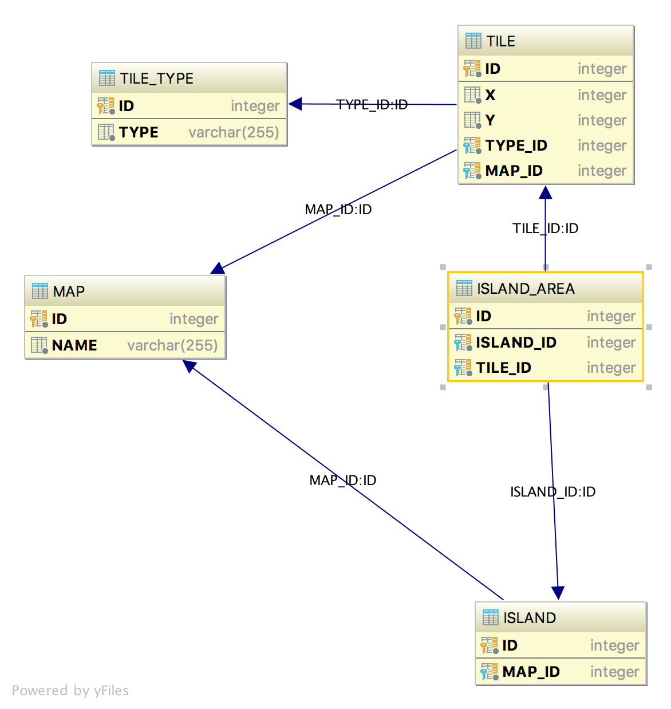

# Island Hopping
This is my first  Kotlin project believe it or not!

## ERD Diagram/DB Schema

I have used H2(in memory db) for easy use of prototyping application.
Island hopping ERD diagram:


## The Magic
Most of the code is easy to understand by first glance(IslandHoppingController is just a spring rest Controller and xxxxxxRepository is a repository and xxxxxEntity is an Entity type)!
```IslandHopingService``` is magic! implemented by converting the Apiary map model tiles to a 
2D array representation and by running ```com.gnaderi.islandhopping.service.IslandHoping.discoverIslands``` algorithm one it will be find connected tiles as List<Island>.


```
interface IslandHopingService {
    fun discoverIslands(tilesEntities: MutableList<TileEntity>, mapId: Int): List<Island>
}
```

```
IslandHoping:

  fun  discoverIslands{...}
  fun  expandIsland{...}
  fun  hasNextTile{...}
  fun  hopToNext{...}
  
  inner class HoppingPointer{...}

```
#### discoverIslands
Create an Array same size of the map tiles size an an extra array to keep in mid which one have been visited to not visit two times.
Hopping through the map and create the first Island when see first LAND tile type! 
#### expandIsland
When save the first LAND Tile Type an Island will be created and tring to expand the Island from First Tile!
#### hasNextTile
Checking where there is any other LAND Tile around the current Tile Pointer as Type HoppingPointer.class
#### hopToNext
Hopping to next available Tile around current Island. 
#### HoppingPointer
Its an inner class using as pointer for pointing to current under processing Tile.


## Docker image
Following instructions explain how to publish IslandHoping tutorial APIs via a portable Docker container.

### Pre-requisites
You need to have:
- a Docker installation available locally. See [Docker website](https://docs.docker.com/install/) on installation instructions for Windows and Linux users.
- at least 100MB of local storage.


### Build image
`./gradlew build buildDocker`


### Start container
`docker run -d -p <SERVER_PORT>:8080 {appName}`
```
docker run -p 8080:8080 com.gnaderi/island-hopping:0.0.1-SNAPSHOT
```
Now if you issue a `docker ps` command you should see a new running container listed.

REST API is configured to listen on ``localhost:8080``.

## API endpoints

Following endpoints are active:

#### /api/maps

``POST`` will create a local representation of Apiary map model.
`curl -X POST  http://localhost:8080/api/maps`

`Map[#x] created!`

``GET`` will returns all maps in ASCII style:  
`curl -X GET http://localhost:8080/api/maps`

            ```------------------------------Map[1]------------------------------
             *~~~~ 
             **~~~ 
             ~~~*~ 
             ~~~** 
             *~**~ 
             ~~~~~ 
             ------------------------------Map[2]------------------------------
             *~~~~ 
             **~~~ 
             ~~~*~ 
             ~~~** 
             *~**~ 
             ~~~~~ 
             ------------------------------Map[3]------------------------------
             *~~~~ 
             **~~~ 
             ~~~*~ 
             ~~~** 
             *~**~ 
             ~~~~~
             ```

#### /api/maps/{id}

``GET`` will returns the map in ASCII style:  
`curl -X GET http://localhost:8080/api/maps/3`
        
        ```
        ------------------------------Map[3]------------------------------
        *~~~~ 
        **~~~ 
        ~~~*~ 
        ~~~** 
        *~**~ 
        ~~~~~ 
        ```
----

#### /api/islands


``GET`` returns all islands found on the map.


```curl -X GET http://localhost:8080/api/islands``` 


#### /api/islands/{id}


``GET`` returns a concrete island.

```curl -X GET http://localhost:8080/api/islands/3```


## Live Version

I have deployed the application on [Heroku](https://www.heroku.com/home) to be able to tested online
App [Island-Hopping](https://island-hopping.herokuapp.com/api/islands)

Create map entries:

```curl -X POST https://island-hopping.herokuapp.com/api/maps```

Get list of Islands:

```curl -X GET https://island-hopping.herokuapp.com/api/islands```
# IslandHopping
